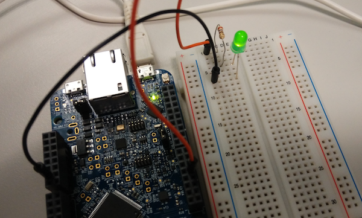
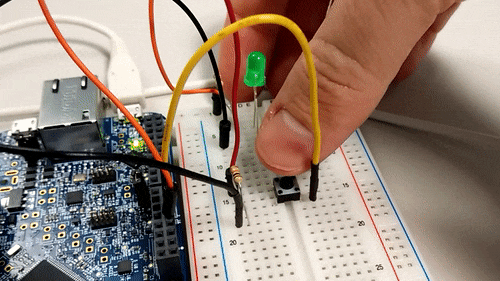

# Blinky on a breadboard

We're now blinking the built-in LED. How unexciting. The great thing about dev kits is that they allows us to add new sensors and peripherals. Let's use an external LED instead.

Get a breadboard, a 220 Ohm resistor (or something close to 220 Ohm), and 2 wires. To know how we should connect everything together we need to take a look at the pinout of the board. Normally, this is listed on the board's page on the mbed website (f.e. here is the [FRDM-K64F pinout](https://developer.mbed.org/platforms/FRDM-K64F/)), but if it's not listed here just do an image search for '[board-name] pinout'.


For the LED sample we just need a ground pin and a digital pin, so note down the digital pin you're using (on the image below I wired it up to a FRDM-K64F on pin PTB23) and set up the circuit.



*Black wire running from GND to the short leg of the LED. Orange wire running from PTB23 via a resistor to long leg of the LED.*

## Changing the code

Now we need to configure the led in our blinky code to no longer reference `LED1`. Change the blinky function to:

```
static void blinky(void) {
    static DigitalOut led(PTB23);
    led = !led;
    printf("LED = %d \r\n",led.read());
}
```

Now the LED on the breadboard will blink rather than the LED on the board.

## Adding a button

Now that we have the breadboard ready anyway, we can also change this program to toggle the LED when a button is being pressed, rather than every 500 ms.

First we need to take another digital pin (in my case PTA2), and wire the button up on the breadboard. Make sure to also have a pull-down resistor to ground. Now we can configure PTA2 as a [`InterruptIn`](https://developer.mbed.org/handbook/InterruptIn) pin and get notified when the button gets pressed or released. Change 'source/app.cpp' to read:

```cpp
#include "mbed-drivers/mbed.h"

static DigitalOut led(PTB23);

static void led_on(void) {
    led = true;    
    printf("LED = %d \r\n", led.read());
}

static void led_off(void) {
    led = false;
    printf("LED = %d \r\n", led.read());
}

void app_start(int, char**) {
    static InterruptIn button(PTA2);
    
    // when we press the button the circuit closes, and put the led on
    button.rise(&led_on);
    // when we release the button the circuit opens again, put it off
    button.fall(&led_off);
}
```


